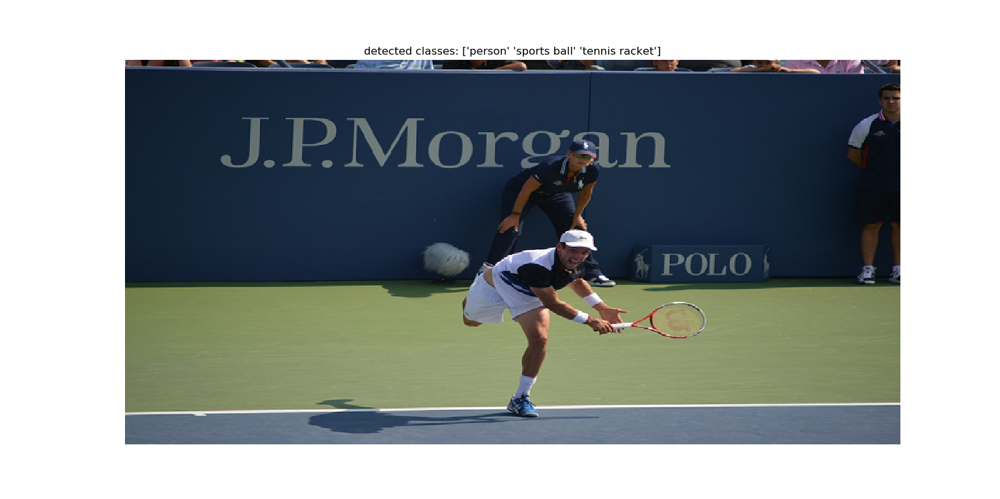
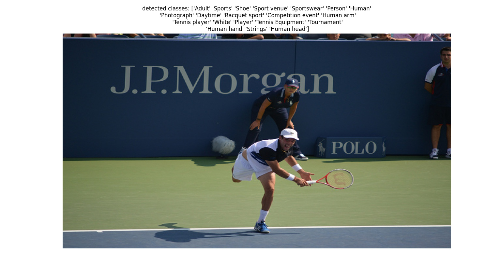

# ML-Decoder pre-trained models

In addition to full reproduction code, we provide a collection of pretrained models with an ML-Decoder classification head.


| Backbone  | Input Size | Dataset | mAP |
| ------------ | :--------------: | :--------------: | :--------------: |
| [TResNet_M ](https://miil-public-eu.oss-eu-central-1.aliyuncs.com/model-zoo/ML_Decoder/tresnet_m_COCO_224_84_2.pth) | 224 | MS-COCO | 84.2 |
| [TResNet_L](https://miil-public-eu.oss-eu-central-1.aliyuncs.com/model-zoo/ML_Decoder/tresnet_l_COCO__448_90_0.pth)  | 448 | MS-COCO | 90.0 |
| [TResNet_XL](https://miil-public-eu.oss-eu-central-1.aliyuncs.com/model-zoo/ML_Decoder/tresnet_xl_COCO_640_91_4.pth) | 640 | MS-COCO | 91.4 |
| [TResNet_M](https://miil-public-eu.oss-eu-central-1.aliyuncs.com/model-zoo/ML_Decoder/tresnet_m_open_images_200_groups_86_8.pth) | 224 | OpenImages | 86.8 |

## MS-COCO  Validation Code
After downloading the models, you can validate their MS-COCO scores using the following script:

```
python validate.py  \
--model-name=tresnet_l \
--model-path=./models_zoo/tresnet_l_COCO__448_90_0.pth \
--image-size=448 \
--data=/home/MSCOCO_2014/
```

## MS-COCO Inference Code
We also provide an [inference code](infer.py), that demonstrate how to load our
model, pre-process an image and do actuall inference. Example run of
MS-COCO model (after downloading the relevant model):
```
python infer.py  \
--model-name=tresnet_l \
--model-path=./models_zoo/tresnet_l_COCO__448_90_0.pth \
--pic-path=./pics/000000000885.jpg \
--image-size=448
```
which will result in:
<p align="center">
 <table class="tg">
  <tr>
    <td class="tg-c3ow"></td>
  </tr>
</table>
</p>


## Open Images Inference Code

```
python infer.py  \
--model-name=tresnet_m \
--model-path=./models_zoo/tresnet_m_open_images_200_groups_86_8.pth \
--pic-path=./pics/000000000885.jpg \
--image-size=224 \
--num-of-groups=200 \
--num-classes=9605 \
--th=0.97
```
which will result in:
<p align="center">
 <table class="tg">
  <tr>
    <td class="tg-c3ow"></td>
  </tr>
</table>
</p>