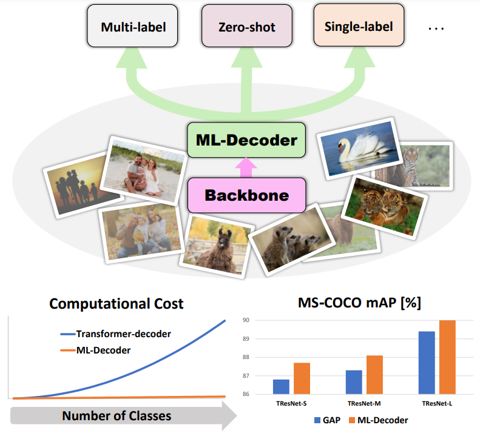
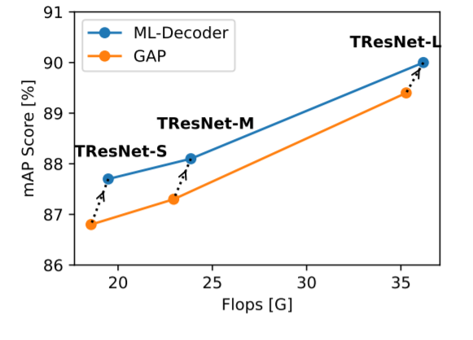

# ML-Decoder: Scalable and Versatile Classification Head

[](https://paperswithcode.com/sota/multi-label-classification-on-ms-coco?p=ml-decoder-scalable-and-versatile)<br>
[](https://paperswithcode.com/sota/multi-label-zero-shot-learning-on-nus-wide?p=ml-decoder-scalable-and-versatile)<br>
[](https://paperswithcode.com/sota/multi-label-classification-on-openimages-v6?p=ml-decoder-scalable-and-versatile)

<br> [Paper](http://arxiv.org/abs/2111.12933)

Official PyTorch Implementation

>  Tal Ridnik, Gilad Sharir, Avi Ben-Cohen, Emanuel Ben-Baruch, Asaf Noy
> <br/> DAMO Academy, Alibaba
> Group

**Abstract**

In this paper, we introduce ML-Decoder, a new attention-based classification head.  ML-Decoder predicts the existence of class labels via queries, and enables better utilization of spatial data compared to global average pooling.
By redesigning the decoder architecture, and using a novel group-decoding scheme, ML-Decoder is highly efficient, and can scale well to thousands of classes. Compared to using a larger backbone, ML-Decoder consistently provides a better speed-accuracy trade-off.
ML-Decoder is also versatile - it can be used as a drop-in replacement for various classification heads, and generalize to unseen classes when operated with word queries. Novel query augmentations further improve its generalization ability.
Using ML-Decoder, we achieve state-of-the-art results on several classification tasks:
on MS-COCO multi-label, we reach 91.4% mAP; on NUS-WIDE zero-shot, we reach 31.1% ZSL mAP; and on ImageNet single-label, we reach with vanilla ResNet50 backbone a new top score of 80.7%, without extra data or distillation.

<p align="center">
 <table class="tg">
  <tr>
    <td class="tg-c3ow"></td>
    <td class="tg-c3ow"></td>

  </tr>
</table>
</p>

## ML-Decoder Implementation
ML-Decoder implementation is available [here](./src_files/ml_decoder/ml_decoder.py).
It can be easily integrated into any backbone using this example code:
```
ml_decoder_head = MLDecoder(num_classes) # initilization

spatial_embeddings = self.backbone(input_image) # backbone generates spatial embeddings      
 
logits = ml_decoder_head(spatial_embeddings) # transfrom spatial embeddings to logits
```
## Training Code 

We will share a full reproduction code for the article results.

### Multi-label Training Code
<br>A reproduction code for MS-COCO multi-label:
```
python train.py  \
--data=/home/datasets/coco2014/ \
--model_name=tresnet_l \
--image_size=448
```

### Single-label Training Code

Our single-label training code uses the excellent [timm](https://github.com/rwightman/pytorch-image-models) repo. Reproduction code is currently from a fork, we will work toward a full merge to the main repo.
```
git clone https://github.com/mrT23/pytorch-image-models.git
```
This is the code for A2 configuration training, with ML-Decoder (--use-ml-decoder-head=1):
```
python -u -m torch.distributed.launch --nproc_per_node=8 \
--nnodes=1 \
--node_rank=0 \
./train.py \
/data/imagenet/ \
--amp \
-b=256 \
--epochs=300 \
--drop-path=0.05 \
--opt=lamb \
--weight-decay=0.02 \
--sched='cosine' \
--lr=4e-3 \
--warmup-epochs=5 \
--model=resnet50 \
--aa=rand-m7-mstd0.5-inc1 \
--reprob=0.0 \
--remode='pixel' \
--mixup=0.1 \
--cutmix=1.0 \
--aug-repeats 3 \
--bce-target-thresh 0.2 \
--smoothing=0 \
--bce-loss \
--train-interpolation=bicubic \
--use-ml-decoder-head=1
```
### ZSL Training Code
<br>First download the following files to the root path of the dataset 

[benchmark_81_v0.json](oss://miil-public-eu/public/NUS_WIDE_ZSL/benchmark_81_v0.json), 
[wordvec_array.pth](oss://miil-public-eu/public/NUS_WIDE_ZSL/wordvec_array.pth), 
[data.csv](oss://miil-public-eu/public/NUS_WIDE_ZSL/data.csv)

Training for NUS-WIDE ZSL:
```
python train_zsl_nus.py  \
--data=/home/datasets/nus_wide/ \
--image_size=224
```

## Citation
```
@misc{ridnik2021mldecoder,
      title={ML-Decoder: Scalable and Versatile Classification Head}, 
      author={Tal Ridnik and Gilad Sharir and Avi Ben-Cohen and Emanuel Ben-Baruch and Asaf Noy},
      year={2021},
      eprint={2111.12933},
      archivePrefix={arXiv},
      primaryClass={cs.CV}
}
```
